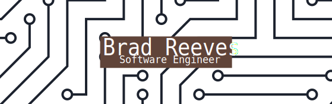
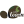
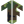
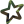
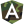

### Greetings, I'm Brad 👋👽

 
 

I'm a PeopleSoft Developer and Graduate Student @ Central Washington University .

- 🔭 I’m currently working on machine learning applications for cybersecurity.
- 🌱 I’m currently learning about Tensorflow, Spark, and various encryption algorithms.
- 👯 I’m looking to collaborate on [ML Interview Toolkit](https://github.com/reevesba/mlit). Note: site is currently down. 

**Languages & Tools**

 
 

<!--
**reevesba/reevesba** is a ✨ _special_ ✨ repository because its `README.md` (this file) appears on your GitHub profile.

Here are some ideas to get you started:

- 🔭 I’m currently working on ...
- 🌱 I’m currently learning ...
- 👯 I’m looking to collaborate on ...
- 🤔 I’m looking for help with ...
- 💬 Ask me about ...
- 📫 How to reach me: ...
- 😄 Pronouns: ...
- ⚡ Fun fact: ...
-->
